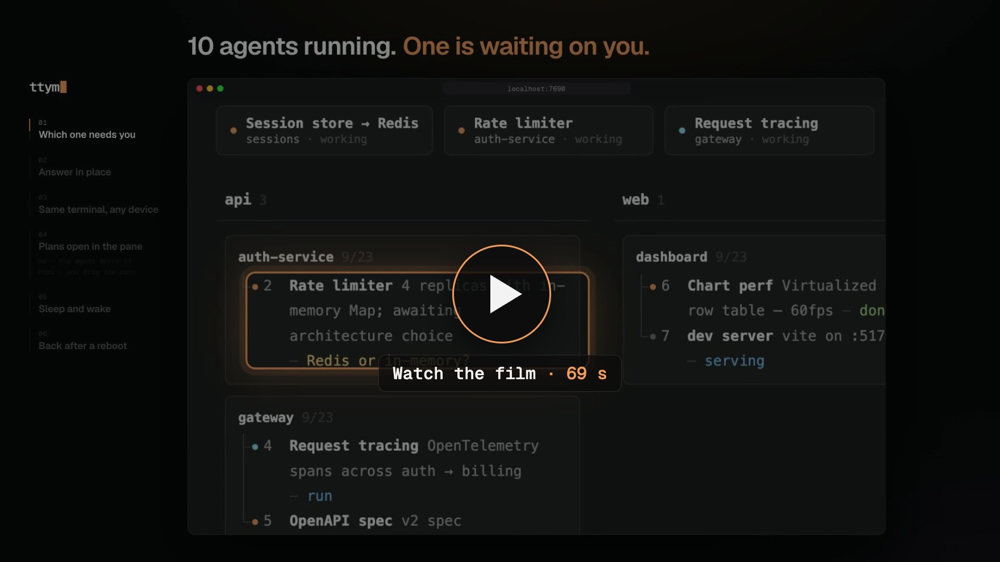
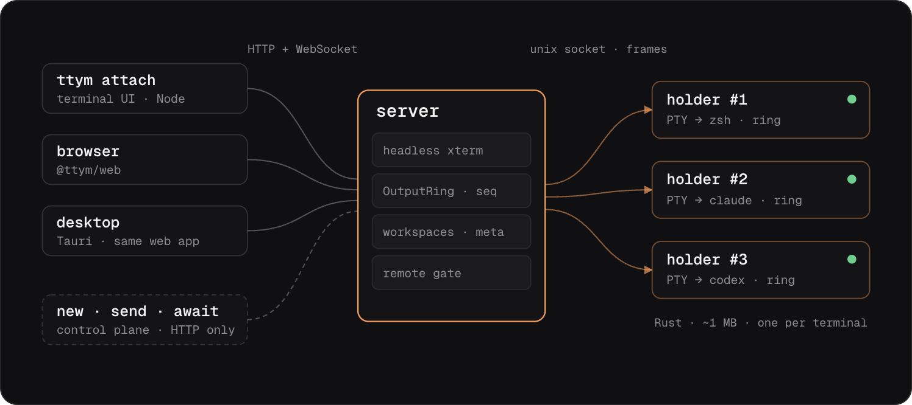

<p align="center">
  <a href="https://ttym.pages.dev">
    <picture>
      <source media="(prefers-color-scheme: dark)" srcset="site/brand/ttym-logo-dark.svg">
      
    </picture>
  </a>
</p>

<h3 align="center">어떤 에이전트가 나를 기다리는지 알고,<br>어디서든 그 터미널로 돌아간다.</h3>

<p align="center">코딩 에이전트를 위한 웹 터미널 멀티플렉서</p>

<p align="center"><a href="https://ttym.pages.dev"><b>웹사이트</b></a> · <a href="#설치">설치</a> · <a href="#빠른-시작">빠른 시작</a> · <a href="https://ttym.pages.dev/#film">영상 (69초)</a> · <a href="docs/remote-access.md">원격 접속</a> · <a href="#cli-레퍼런스">CLI</a> · <a href="#작동-방식">작동 방식</a> · <a href="README.md">English</a></p>

<p align="center">
  <a href="https://ttym.pages.dev/#film"></a>
</p>

코딩 에이전트를 여러 개 돌리다 보면 하나는 내 입력을 기다리고 나머지는
아직 작업 중인데, 어느 쪽인지 찾으려고 터미널 탭을 돌아다니게 된다.

## 설치

```bash
curl -fsSL https://raw.githubusercontent.com/esc5221/ttym/master/install.sh | sh
```

Node 20 이상이 필요하다.

그다음:

```bash
ttym service install        # 로그인하면 뜨고, 죽으면 다시 뜬다
ttym agent install claude   # Claude Code 훅 (codex도)
```

<details>
<summary>소스에서</summary>

Node 20 이상, Rust, pnpm이 필요하다.

```bash
git clone https://github.com/esc5221/ttym && cd ttym
pnpm install
./scripts/build.sh
ln -s "$PWD/dist/ttym" ~/.local/bin/ttym
```

</details>

## 빠른 시작

```bash
ttym work                      # workspace "work"와 셸을 만들고 진입
ttym split :main ai -- claude  # 옆에 분할해서 Claude Code 실행
open http://localhost:7690     # 같은 세션을 브라우저에서
```

`C-b d`로 나와도 전부 계속 돈다.

## 작동 방식

터미널마다 PTY는 holder에 산다. holder는 PTY와 그 출력의 raw ring을 쥐고 있는 작은
Rust 프로세스다. 서버는 세션마다 headless xterm을 돌려서 화면과 스크롤백을 안다.
뷰어는 서버하고만, holder는 서버하고만 이야기한다. 그래서 서버를 재시작하거나
업그레이드해도 터미널이 닫히지 않는다.

<p align="center">
  
</p>

패키지 계층 (아래일수록 바닥):

| 계층 | 패키지 | 역할 |
| --- | --- | --- |
| Consumer | [`@ttym/web`](packages/web) | 브라우저 앱 |
| | [`@ttym/desktop`](packages/desktop) | 같은 웹 앱을 감싼 Tauri 앱 |
| Contract | [`@ttym/cli`](packages/cli) | new · split · send · await · screen |
| | [`@ttym/protocol`](packages/protocol) | wire 포맷, 서버와 클라이언트가 같이 씀 |
| | [`@ttym/api`](packages/api) | 앱용 HTTP 클라이언트 |
| Core | [`@ttym/server`](packages/server) | 세션, 화면, workspace, 원격 관문 |
| | [`@ttym/vt`](packages/vt) | 클라이언트 코어: WebSocket mux, 로컬 에코 |
| | [`@ttym/ui`](packages/ui) | React 터미널과 레이아웃 뷰 |
| | [`@ttym/shared`](packages/shared) | 양쪽이 같이 지키는 규칙 (레이아웃 트리) |
| Base | [`holder`](holder) | Rust, 터미널마다 하나, PTY를 소유 |

더 보기: [ttym.pages.dev/internals](https://ttym.pages.dev/internals)

## 하는 일

- **누가 나를 기다리는지.** 작업 지도가 모든 세션을 지금 하는 일과 기다리는 것
  한 줄씩으로 보여 준다. `ttym map refresh`
- **멈춘 자리에서 답하기.** 브라우저의 pane이 곧 터미널이고, 같은 세션을 CLI로도
  연다. `ttym attach auth-service/limiter`
- **같은 터미널을 폰에서.** tailnet에서는 내 Tailscale 계정으로 로그인된 기기가
  별도 로그인 없이 연다. `ttym remote tailscale`
- **계획서가 pane에 열린다.** Markdown, HTML, CSV, 이미지, URL이 그걸 만든 pane의
  탭으로 열린다. `ttym open PLAN.md`
- **쉬는 에이전트는 잔다.** 30분 동안 아무 일이 없으면 에이전트 프로세스를 내리고
  화면은 남긴다. 다음 키 입력이 같은 대화를 이어 연다. `ttym agent sleep :limiter`
- **재부팅 뒤에도.** 모든 pane이 마지막 화면으로 돌아오고, 에이전트는 같은 대화에서
  이어진다. `ttym agent resume`

## 에이전트를 함수처럼

```bash
ttym workspace add --current --name helper --role agent --cmd claude
ttym await :helper --json -- "이 스택트레이스 원인 뭐야?"
```

`await`은 프롬프트를 보내고, 에이전트의 턴이 끝나면 그 턴의 답을 돌려준다.

## 셸 통합

`~/.zshrc`에 한 줄:

```bash
[[ -n "$TTYM_SESSION_ID" ]] && source ~/.local/share/ttym/scripts/ttym-shell-integration.zsh
```

그러면 일반 셸도 명령 단위로 다룰 수 있다:

```bash
ttym commands :build              # 실행한 명령과 exit code
ttym output :build --cmd 3        # 명령 하나의 출력
ttym await :build -- "make test"  # 실행하고 기다려서 exit code + 출력
```

## 웹 터미널

- **⌘F**로 스크롤백을 검색한다.
- **⌘↑ / ⌘↓**로 명령 사이를 이동한다 (셸 통합 필요).
- **URL**을 누를 수 있고, 세션 안의 프로그램이 클립보드를 쓸 수 있다.
- 파일을 pane에 **끌어다 놓으면** 경로가 입력된다.

## 다른 기기에서

```bash
ttym remote tailscale
```

이 기기 밖에서 오는 요청은 허용된 호스트와 로그인이 필요하다. Cloudflare Tunnel,
SSH와 세부 동작은 [docs/remote-access.md](docs/remote-access.md).

## CLI 레퍼런스

### 주소 체계

```
ws:name     workspace "ws" 의 멤버 "name"
:name       현재 workspace 의 멤버 (TTYM_SESSION_ID 로 추론)
#42         세션 id 직접 지정 — workspace 미소속 세션도 이걸로 항상 접근 가능
```

CLI 는 기동 시 `/api/version` 의 `API_VERSION` 을 확인하고, 어긋나면 조용히 오동작하는 대신 실행을 거부한다.

전역 플래그(`--port`, `--json`)는 명령줄 어디에 있어도 된다 — dispatch 전에 선추출되므로 `--cmd` 가 삼키지 못한다. `--` 뒤는 전부 그대로 통과된다.

exit code 는 계약이고, contract 스위트가 검증한다:

```
0  성공
1  일반 실패
2  usage 오류
3  대상 해석 실패 (모르는 주소·모호한 주소)
4  서버 연결 불가
5  API 버전 불일치
```

### attach — 인터랙티브 TUI

`ttym attach`는 `tmux attach`처럼 동작한다. 지금 터미널이 그 세션이 되고, prefix 키
(`C-b`)로 명령을 시작하며, detach해도 전부 계속 돈다.

```
tmux                          ttym
tmux new -s work              ttym work
tmux attach -t work           ttym work          (또는 ttym attach work)
C-b d   detach                C-b d
C-b s   세션 고르기            C-b s              세션 피커
C-b n/p 다음/이전 창           C-b n/p            workspace의 다음/이전 멤버
C-b ?   키 목록               C-b ?
tmux split-window             ttym split :main ai -- claude
set -g prefix C-a             ttym attach work --prefix C-a
```

다른 점:

- **한 번에 멤버 하나.** attach는 workspace의 세션 하나를 터미널에 보여 주고,
  `C-b n/p`로 옮겨 다닌다. 분할은 브라우저에서 나란히 배치된다.
- **한 세션을 여러 곳에서.** CLI, 브라우저, 폰이 같은 세션에 동시에 붙을 수 있다.
  `--readonly`는 입력 없이 보기만 한다.
- **서버가 재시작해도 된다.** 세션마다 PTY가 별도 holder 프로세스에 살기 때문에
  서버를 멈추거나 재시작, 업그레이드해도 세션이 끝나지 않는다. tmux는 서버가
  세션을 들고 있다.

```bash
ttym <workspace>                         # attach 의 축약 — 일상의 진입
ttym attach <session-id>
ttym attach <workspace>                  # 멤버 하나면 그것, 여럿이면 첫 멤버 (C-b n/p 순회)
ttym attach <workspace>/<member>         # 없으면 [Y/n] 확인 후 생성; --new 는 확인 생략(스크립트용)
ttym attach work/ai --new --cmd claude --dangerously-skip-permissions
ttym attach <target> --readonly          # 관찰만
ttym attach <target> --prefix C-a        # prefix 키 변경 (기본 C-b)
```

키 바인딩 (prefix = 기본 `C-b`):

```
C-b d         detach (세션은 계속 돈다)
C-b s         세션 피커
C-b n / p     다음 / 이전 workspace 멤버
C-b ?         도움말
C-b C-b       PTY 에 prefix 문자 그대로 전송
C-]           대체 detach
```

### 세션

```bash
ttym new <name> [-- <cmd...>]              # 기본 cmd: $SHELL
ttym split <ws:name|:name> <new> [-- cmd]  # 대상 옆에 분할
ttym send <ws:name|:name|#id> -- "data"    # PTY 에 raw byte
ttym screen <ws:name|:name|#id> [--json]   # 현재 화면 읽기
ttym await <ws:name|:name|#id> [--timeout ms] -- "prompt"
                                           # 에이전트 턴 또는 셸 명령 (셸 통합)
ttym commands <addr> [--limit N]           # 명령 이력 (셸 통합)
ttym output <addr> [--cmd N|last] [--raw]  # 그 명령의 출력만 ring 에서 슬라이스
ttym resize <ws:name|:name|#id> <cols> <rows>
ttym kill <ws:name|:name|#id>              # 세션 종료, holder 포함
ttym map refresh [--model M] [--base-url URL] [--note TEXT] [--force] [--dry-run]
```

### 서버 수명

이야기는 하나다: **진입 동사(이름 단독, attach, new, split)는 서버가 없으면
띄운다** — 시작하려고 `start` 를 칠 일이 없다. 조회 동사(screen, send,
await, …)는 exit 4 계약을 지키고 아무것도 띄우지 않는다.

```bash
ttym service install       # 상주: 로그인 시 기동, 죽으면 자동 재기동
ttym service status        # 감독 여부·pid·마지막 종료 사유 [--json]
ttym service uninstall     # 게으른 자동기동 세계로 복귀 (세션은 생존)

ttym stop                  # 비감독 서버 중지. holder 는 생존
ttym restart               # 감독 중이면 launchd/systemd 에 위임, 아니면 stop+start
ttym status                # 서버 + 세션 목록
ttym log [-f]              # ~/.ttym/ttym.log
ttym start [--port] [--bind]  # 일회성 수동 기동 (개발용; 감독 중엔 거부)
ttym upgrade [--rollback]     # 최신 릴리스로 교체, 세션은 그대로 돈다
```

감독 사실은 `~/.ttym/service.json` 마커에 산다 — restart 는 추측이 아니라
그 마커로 위임을 판단한다. 생성되는 plist 는 재기동을 10초로 스로틀하고,
직전 3회 부팅이 전부 수초 내 사망이면 다음 부팅은 **safe mode** — 세션
복구를 건너뛰어(holder 는 무접촉) poison 세션이 감독자를 크래시 루프에
빠뜨리지 못한다. `/api/version` 이 `safeMode: true` 로 보고한다.

### workspace 컨트롤 플레인

```bash
ttym current [--json]                       # 이 세션의 workspace/member
ttym workspace list [--json]
ttym workspace info <ws|--current> [--json]
ttym workspace create <name>
ttym workspace rename <ws|--current> --name <new>
ttym workspace delete <ws|--current>

ttym workspace add <ws|--current> --name <m> [--role <r>] [--cmd <cmd...>]
ttym workspace member rename <ws|--current> <m> --name <new>

ttym workspace detach    <ws|--current> <m>   # 멤버십만 해제, 세션 유지
ttym workspace remove    <ws|--current> <m>   # 멤버십 해제 + 세션 종료
# `terminate` 는 없어졌다 — `remove` 의 다른 이름이었다.
```

`--current` 는 모든 ttym 세션에 자동 주입되는 `TTYM_SESSION_ID` 로 workspace 를 해석한다.

### meta — 세션 KV

```bash
ttym meta <session-id>                           # 병합 뷰 (runtime + annotations)
ttym meta <id> --set name=worker                 # 사용자 KV → annotations 로
ttym meta <id> --claude-session <uuid>           # Claude 세션 연결
ttym meta <id> --codex-session <uuid>
```

meta 는 소유권이 갈라져 있다: runtime 키(`claude*`, `codex*`, `stopSeq`, …)는 서버 소유 — 공개 PATCH 는 400 이고, 훅은 내부 API 로 쓴다. 나머지는 전부 사용자 소유(annotations). 분류 규칙은 `@ttym/protocol` 에 있다.

### agent — 훅 설치

```bash
ttym agent install claude       # ~/.claude/settings.json 에 SessionStart+Stop 훅 주입
ttym agent install codex        # ~/.codex/hooks.json (codex_hooks 플래그 필요, v0.114+)
ttym agent uninstall <agent>
ttym agent status
ttym agent info [session-id]    # ttym 세션에 연결된 claude/codex 세션
ttym agent resume [agent]       # 그 세션으로 claude --resume / codex resume
```

## 레퍼런스

<details>
<summary>제거</summary>

```bash
ttym service uninstall
ttym stop
rm -rf ~/.local/share/ttym ~/.local/share/ttym.prev ~/.local/bin/ttym
rm -rf ~/.ttym              # 세션, 설정, 원격 로그인
```

</details>

<details>
<summary><b>HTTP API</b> — 모든 라우트, 입출력은 JSON</summary>

기본 베이스 `http://localhost:7690`.

```
GET    /api/version                         API_VERSION — 클라이언트 호환성 확인
GET    /api/sessions                        세션 목록
POST   /api/sessions                        생성 {cmd, cols, rows, cwd?, verify?}
GET    /api/sessions/:id                    세션 하나
DELETE /api/sessions/:id                    종료 (holder 포함)
POST   /api/sessions/:id/send               {data} → PTY 에 raw byte
GET    /api/sessions/:id/screen             현재 화면 덤프 (전체 serialize)
POST   /api/sessions/:id/resize             {cols, rows}
GET    /api/sessions/:id/runtime            조립된 서버 소유 뷰 (terminal·process·agent)
GET|PATCH /api/sessions/:id/annotations     사용자 소유 KV
GET|PATCH /api/sessions/:id/meta            병합 뷰 — 호환 어댑터. runtime 키는 400
POST   /api/sessions/:id/interactions       {prompt, timeoutMs?} → 답변까지 블로킹
GET    /api/sessions/:id/interactions/:iid  202 로 넘어간 interaction 재개
GET    /api/sessions/:id/commands           명령 인덱스 (셸 통합; 신호 없으면 빈 목록)
POST   /api/sessions/:id/commands           실행-후-대기 {data} → exit code (신호 없으면 409)
GET    /api/sessions/:id/commands/:n/output 그 명령의 바이트만 ring 에서 슬라이스
POST   /api/internal/sessions/:id/stop      에이전트 Stop 훅 전용
POST   /api/internal/sessions/:id/agent     훅의 runtime 키 쓰기 전용
POST   /api/upload?name=<file>              raw body → ~/.ttym/drops, Finder 식 이름 중복 처리

GET|PATCH /api/config                       flat 설정 파일 — 모든 클라이언트에 push
GET    /api/map                             작업 지도: workspace + 세션 + 요약 + 신선도
GET|PUT /api/map/prompt                     요약기 지시문 (빈 PUT = 기본값 복귀)
POST   /api/map/refresh                     요약기 실행 ({note?}; single-flight)
GET|POST /api/map/api-key                   write-only 키 저장소; GET 은 {set} 만

GET    /api/workspaces                      workspace 목록
POST   /api/workspaces                      생성 {id, name, layout} — 이름이 곧 주소(전역 유일)
GET|PATCH|DELETE /api/workspaces/:id        PATCH 는 {map} 배치도 받는다
POST   /api/workspaces/:id/members          멤버 추가 {sessionId, name, role?, tags?}
PATCH|DELETE /api/workspaces/:id/members/:sid
POST   /api/workspaces/:id/split            layout 연산
```

</details>

<details>
<summary><b>WebSocket 프레임 프로토콜</b> — opcode 0x00–0x10</summary>

바이너리 프레임: `uint16 sessionId · uint8 cmd · payload`.

```
0x00 DATA         PTY ↔ viewer 바이트 스트림 (출력에만 seq)
0x01 RESIZE       {cols, rows}
0x02 CREATE       WS 로 세션 생성
0x03 DESTROY      세션 종료됨
0x04 PAUSE        세션 출력 일시정지 (서버 측)
0x05 RESUME
0x06 HELLO        {clientId}
0x07 LIST         세션 목록
0x08 ATTACH       {fromSeq, cols, rows, mode}
0x09 DETACH
0x0a SNAPSHOT     전체 화면, UTF-8 (ATTACH 응답)
0x0b ACK          {seq} — viewer 가 파싱 완료를 확인; 배압과 ring trim 을 이끈다
0x0c PAUSE_VIEW   viewer 측 일시정지 (숨은 pane 은 버퍼 유지, 스트림만 중단)
0x0d RESUME_VIEW
0x0e WORKSPACE    server → client: workspace 변경 (push, 폴링 없음)
0x0f AGENT        server → client: 세션의 에이전트 상태 변경 (kind/active)
0x10 CONFIG       server → client: 설정 파일 변경 — 항상 전체 값, diff 없음
```

</details>

<details>
<summary><b>설정 파일</b> — <code>~/.ttym/config</code>, 모든 표면의 단일 진실</summary>

flat `key = value`, `#` 주석 (ghostty 모델). 서버가 파일을 소유하고 `GET /api/config` 로 서빙한다; 클라이언트가 PATCH 하면 모든 표면(웹·데스크톱·모든 창)이 따라온다. 주석과 모르는 줄은 편집에서 살아남는다. 비밀은 절대 넣지 마라 — 모든 클라이언트에 서빙되는 파일이다.

```
theme        = dark | light         UI + 터미널 팔레트
ui-style     = frame | classic      크롬 스타일
main-view    = preview | map        메인 화면: 세션 미리보기 또는 작업 지도
font-size    = 14                   터미널 폰트 크기 (8–32)
local-echo   = true | false         낙관적 local echo (실험적)
zoom         = 1.0                  데스크톱 창 zoom (앱이 쓴다)
map-model    = haiku                ttym map refresh의 요약 모델
map-base-url =                      있으면 OpenAI 호환 HTTP; 없으면 claude CLI
map-interval =                      서버 내장 주기 (10m, 1h) — 비우면 off (기본)
```

의도적으로 이 파일 밖에 있는 것: 요약기 API 키는 `~/.ttym/map-api-key`(chmod 600) 또는 `OPENAI_API_KEY` 에 산다.

</details>

<details>
<summary><b>환경 변수 · 런타임 경로</b></summary>

```
PORT                   서버 포트 (기본 7690)
TTYM_BIND              listen 호스트 (기본 127.0.0.1). 인터페이스 개방은 부팅 시점에만
                       정한다. LAN 요청도 허용 호스트 + 로그인이 필요하다
                       (docs/remote-access.md)
TTYM_HOME              ~/.ttym 루트 교체 (테스트 격리)
TTYM_RUNTIME_DIR       holder socket/manifest 디렉토리 (기본 ~/.ttym/run)
TTYM_HOLDER_BIN        holder 바이너리 경로 (기본: dist/ 에서 자동 탐지)
TTYM_GC_DAYS           미참조 snapshot/meta 유예 일수 (기본 14, 0=off)
TTYM_SESSION_ID        ttym 세션 안에 자동 주입 (attach/훅이 사용)
TTYM_PREFIX            attach TUI prefix 키 (기본 C-b)
TTYM_HTTP_TIMEOUT_MS   CLI HTTP 타임아웃 (기본 5000)
TTYM_ATTACH_RETRY_MS   attach 재접속 간격 (기본 1000)
```

```
~/.ttym/
├── config                서버 소유 설정 (설정 파일 참조)
├── map-api-key           요약기 키, 0600 — 절대 서빙 안 됨
├── map-prompt.txt        편집된 요약기 지시문 (없으면 내장 기본값)
├── ttym.pid              서버 PID
├── ttym.log              서버 stdout/stderr (64MB 에서 copy-truncate → .1)
├── drops/                브라우저 드래그드롭으로 올라온 파일
└── run/
    ├── workspaces.json       workspace + 멤버 + 지도 배치 (atomic write)
    ├── session-<id>.json     holder manifest
    ├── session-<id>.sock     holder unix socket
    ├── snapshot-<id>.json    체크포인트 (렌더된 ANSI + offset)
    ├── meta-<id>.json        세션 meta
    └── next-id               세션 id 카운터
```

</details>

<details>
<summary><b>세션 영속성과 integrity</b> — 세션이 어떻게, 얼마나 정직하게 살아남는가</summary>

holder 가 별도 프로세스라서 PTY 는 서버보다 오래 산다.

```bash
ttym work                     # 세션 하나
ttym restart                  # 서버가 내려갔다 올라와도
ttym status                   # 세션은 그대로다. 같은 pid — 붙어서 계속하면 된다

# 감독 중이라면 강제 kill 조차 스스로 낫는다:
ttym service install
kill -9 "$(cat ~/.ttym/ttym.pid)"   # 감독자가 수초 내 되살린다 — 세션 무사
```

복구는 세 겹이다:

- **체크포인트.** 서버가 주기적으로 세션별 렌더된 ANSI 스냅샷을 디스크에 쓴다(유휴 2초 / 최대 30초, applied offset·holder 세대·행별 wrap 비트 포함). 재시작 시 체크포인트로 xterm 을 seed 하고 holder 에는 그 offset 이후의 delta 만 요청한다.
- **컨트롤러 lease.** holder 는 컨트롤러를 하나만 받는다. 새 서버는 명시적으로 `ACQUIRE` 해야 하고, 자리가 차 있으면 거절당한다 — 그리고 거절은 *점유*지 *사망*이 아니다: workspace 복원은 남이 쥔 세션을 부활시키지 않고, 라이벌 서버 부트는 holder 를 건드리기 전에 포트 검사에서 문전 사살된다.
- **소켓 자가치유.** holder 는 5초마다 자기 소켓 경로를 확인하고, 파일이 사라졌으면 다시 바인드하고 manifest 를 다시 쓴다 — 살아 있는 PTY 가 연락두절이 되는 일은 없다.

**integrity 는 일급 플래그다.** 복구가 바이트를 건너뛰어야 했다면(offset 이 holder ring 밖으로 밀려남) 세션은 `/runtime` 에 `integrity: "degraded"` 를 보고하고, `await` 결과에 실리고, CLI 는 stderr 로 경고한다. 리플레이는 이스케이프 시퀀스 한가운데서 시작하지 않는다 — holder 가 UTF-8 + ECMA-48 렉서로 안전 경계를 추적한다. 스트림에 완전한 터미널 리셋(`RIS`)이 나타나야만 플래그가 치유되고, degraded 체크포인트는 쓰긴 하되 복구 기반으로는 절대 쓰지 않는다.

부팅 복구는 workspace 가 참조하는 세션만 되살린다; 미참조 snapshot/meta 는 14일 유예 후 GC 된다(`TTYM_GC_DAYS`, 0=off).

</details>

<details>
<summary><b>훅과 await 의 내부</b> — 에이전트 루프 뒤에서 벌어지는 일</summary>

- **SessionStart**: Claude/Codex 가 시작되면 그 세션 id 가 `TTYM_SESSION_ID` 가 가리키는 ttym 세션에 기록된다 (`claudeSessionId` / `codexSessionId`).
- **UserPromptSubmit** (Claude): 턴마다 활동 플래그를 재장전한다 — 웹의 "실행 중" 점은 낡았을지 모르는 플래그를 영원히 믿는 대신 15분 liveness TTL 을 갖는다.
- **Stop**: 턴 완료를 서버에 보고한다 (`POST /api/internal/sessions/:id/stop`). StopFailure 와 SessionEnd 도 등록되어 있어 실패한 턴은 타임아웃이 아니라 즉시 정산된다.

```
scripts/ttym-claude-hook.sh           Claude SessionStart
scripts/ttym-claude-activity-hook.sh  Claude UserPromptSubmit
scripts/ttym-claude-stop-hook.sh      Claude Stop
scripts/ttym-codex-stop-hook.sh       Codex Stop
scripts/ttym-shell-integration.zsh    zsh OSC 133/633 표시
```

`ttym await` 는 완료 신호를 증거로 고른다:

- **에이전트 pane** (훅 설치됨): 프롬프트 + CR 을 보내고 Stop 훅을 기다린 뒤 **답변**을 읽는다 — 디스크의 구조화 transcript 에서 그 턴의 마지막 assistant 메시지를 먼저(`transcriptSource: "structured"`), 안 되면 xterm marker 와 커서 사이의 렌더된 화면에서(`"screen"`). marker 가 밀려나갔으면 남의 출력 대신 null 을 준다.
- **셸 pane** (통합 신호 관측됨): 명령을 보내고 OSC `133;D` 표시까지 막은 뒤, exit code 와 `[startSeq, endSeq)` 창으로 슬라이스한 출력을 돌려준다.

타임아웃 시 interaction 은 202 + Location 으로 넘어가고 id 로 재개할 수 있다. 여러 멤버 동시 await 는 각자 독립적으로 완료된다.

</details>

<details>
<summary><b>개발 · 데스크톱 릴리즈</b></summary>

```bash
pnpm test                     # vitest — 실제 holder·실제 PTY 를 띄우고 프로덕션 fixture 를 리플레이
pnpm test:e2e                 # Playwright
pnpm --dir packages/server dev
pnpm --dir packages/web dev   # 브라우저 앱 (Vite, 별도 포트)
pnpm desktop:dev              # Tauri 앱 (dev 셸; TTYM_PORT 로 지정)
```

pnpm workspace 멤버: `packages/*` 9개 + Rust `holder/`.

데스크톱 릴리즈:

```bash
pnpm desktop:build            # tauri build → .app  (scripts/build.sh 를 선행하므로
                              #  동봉 폴백 dist 가 최신으로 실린다)
ditto packages/desktop/src-tauri/target/release/bundle/macos/ttym.app /Applications/ttym.app
```

언제 재빌드하나: 앱은 *서빙되는* 웹 UI 를 감싼 네이티브 셸이라 웹 변경은 서버 배포만으로 도달한다 — 재빌드 불필요. `packages/desktop/src-tauri` 가 바뀌었거나, 서버가 없을 때 부트스트랩용으로 쓰는 동봉 `dist/` 를 갱신할 때만 재빌드한다.

</details>

## 문서

- [docs/architecture.md](docs/architecture.md) — 계층, holder 프로토콜, wire 포맷, meta 소유권, 작업 지도, 운영 위생
- [docs/adr-0001-membership.md](docs/adr-0001-membership.md) — workspace 멤버십 모델
- [docs/remote-access.md](docs/remote-access.md) — Tailscale, Cloudflare Tunnel + Access, SSH, LAN, 원격 로그인 동작
