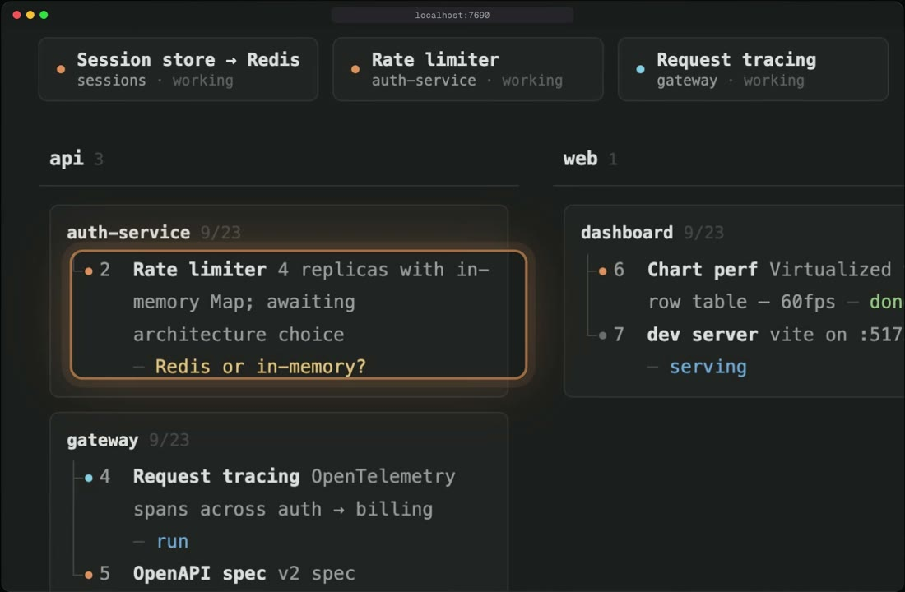
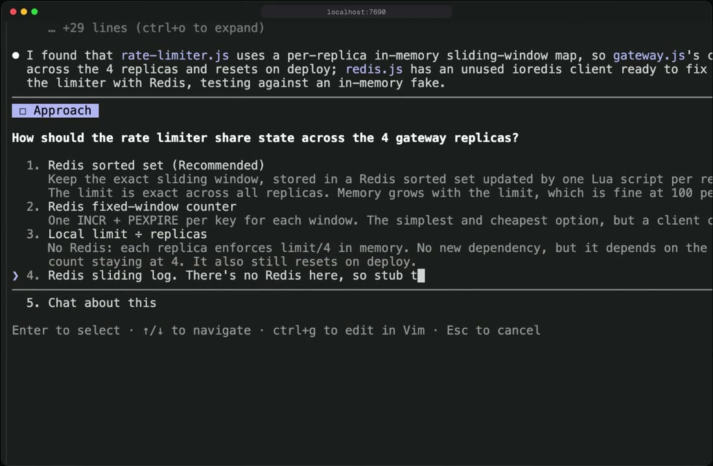
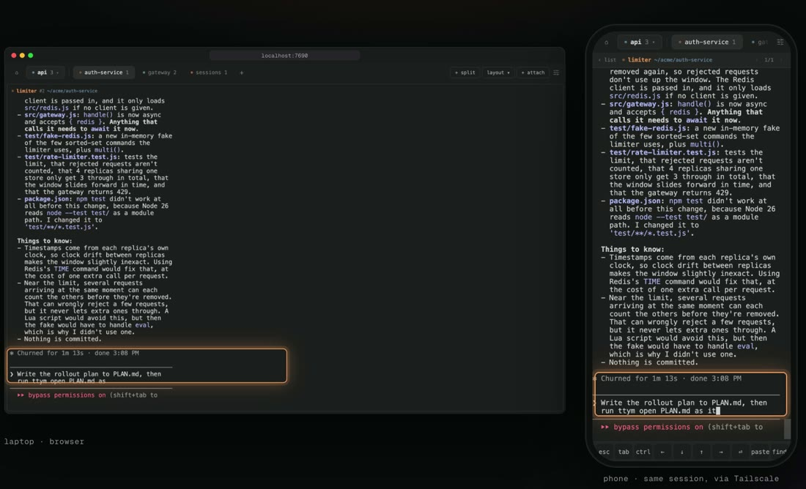
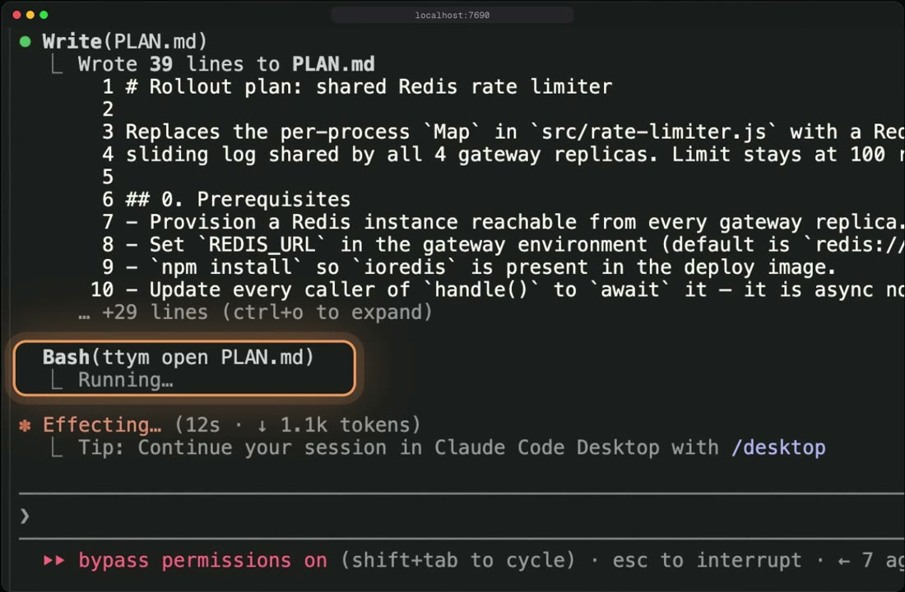
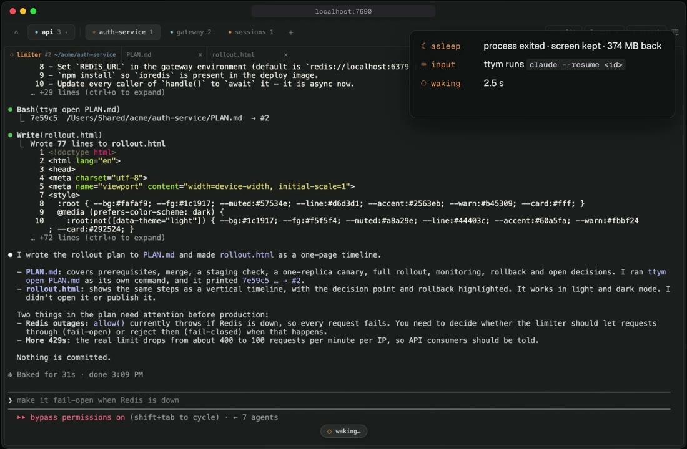
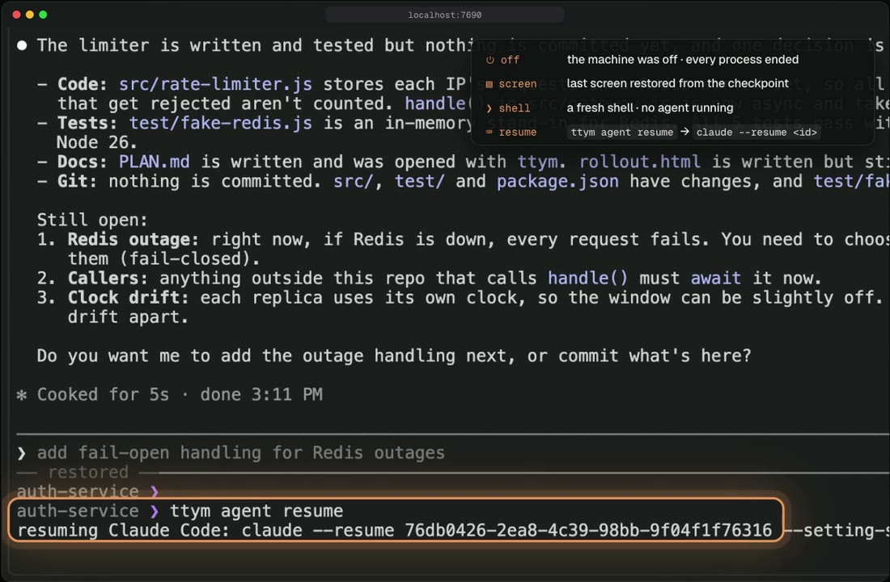

<p align="center">
  <a href="https://ttym.pages.dev">
    <picture>
      <source media="(prefers-color-scheme: dark)" srcset="site/brand/ttym-logo-dark.svg">
      
    </picture>
  </a>
</p>

<h3 align="center">Know which agent needs you.<br>Get back into its terminal from anywhere.</h3>

<p align="center">A web terminal multiplexer for coding agents · macOS and Linux · Node ≥ 20</p>

<p align="center"><a href="https://ttym.pages.dev"><b>Website</b></a> · <a href="#install">Install</a> · <a href="#quick-start">Quick start</a> · <a href="https://ttym.pages.dev/#film">Film (69 s)</a> · <a href="docs/remote-access.md">Remote access</a> · <a href="#architecture">Architecture</a> · <a href="README.ko.md">한국어</a></p>

<p align="center">
  <a href="https://ttym.pages.dev/#film"></a>
</p>

You're running a dozen coding agents. One is blocked on you, the rest are still
working, and you're cycling through terminal tabs to find which. ttym is a web
terminal multiplexer: one server holds every PTY, and the browser, the CLI and
your phone are views of the same live terminals.

## Install

```bash
curl -fsSL https://raw.githubusercontent.com/esc5221/ttym/master/install.sh | sh
```

The script downloads the build for your machine (macOS or Linux, arm64 or
x86_64) from [GitHub Releases](https://github.com/esc5221/ttym/releases),
checks its sha256, installs it to `~/.local/share/ttym` and links `ttym` into
`~/.local/bin`. Node ≥ 20 is the only prerequisite. It is short;
[read it](install.sh) before piping it to `sh`. `TTYM_VERSION=v0.3.0` pins a
version.

Then, once per machine:

```bash
ttym service install        # starts at login, restarts after a crash
                            # (launchd on macOS, systemd on Linux)
ttym agent install claude   # Claude Code hooks: who needs you, await,
                            # sleep/wake (codex too)
```

Without the service, the first `ttym` command starts the server in the
background and nothing brings it back after a reboot. Either way each terminal
lives in its own holder process, so restarting or upgrading the server does not
close it.

```bash
ttym upgrade                # swap in the latest release; sessions keep running
ttym upgrade --rollback     # back to the previous install
```

<details>
<summary>From source (development)</summary>

Prerequisites: Node.js ≥ 20, Rust, pnpm.

```bash
git clone https://github.com/esc5221/ttym && cd ttym
pnpm install
./scripts/build.sh
ln -s "$PWD/dist/ttym" ~/.local/bin/ttym
```

Build outputs:

```
dist/
├── ttym              # CLI (esbuild bundle)
├── ttym-server.js    # bundled server
└── ttym-holder       # Rust binary (one per session)
packages/web/dist/    # the web app the server serves
```

In a checkout, `ttym upgrade` rebuilds into `dist.next` and swaps by rename —
running sessions keep their processes.

</details>

<details>
<summary>Uninstall</summary>

```bash
ttym service uninstall                       # if you installed the service
ttym stop
rm -rf ~/.local/share/ttym ~/.local/share/ttym.prev ~/.local/bin/ttym
rm -rf ~/.ttym                               # state: sessions, config, remote logins
```

Terminals that are still open keep running in their holder processes until you
exit them.

</details>

## Quick start

```bash
ttym work                      # starts the server if needed, creates workspace
                               # "work" + a shell (one [Y/n]) and attaches
ttym split :main ai -- claude  # a real split beside it
open http://localhost:7690     # the same session, live in the browser
ttym remote tailscale          # and on your phone ("From another device")
```

`C-b d` detaches; everything keeps running.

## What it does

The six chapters of the film above, each with the command behind it.

### 01 · 10 agents running. One is waiting on you.



The work map lists every session with a one-line summary of what it is doing
and what it waits on. The one that needs you says so; click it and you are in
its terminal.

```bash
ttym map refresh          # summarize every session that changed
```

### 02 · Jump in. Answer right where it stopped.



The pane in the browser is the terminal itself, not a dashboard: pick an
option on the agent's question card, type your answer, and it goes back to
work. The same session opens in the CLI.

```bash
ttym attach auth-service/limiter
```

### 03 · Same terminal, on your phone.



One process holds the terminal; the laptop and the phone are both views of it.
On your tailnet, devices signed in to your Tailscale account open ttym with no
extra login ([other ways in](docs/remote-access.md)).

```bash
ttym remote tailscale
```

### 04 · The agent runs ttym open. The plan opens in its pane.



Markdown, HTML, CSV, images and URLs open as tabs on the pane that produced
them. Select a path in the terminal and open it the same way.

```bash
ttym open PLAN.md rollout.html
```

### 05 · Idle agents sleep. Same conversation when they wake.



An agent left alone for 30 minutes is stopped and its RAM returned (374 MB in
the film). The screen stays; the next keystroke runs `claude --resume` with the
same session id — back in 2.5 s in the film.

```bash
ttym agent sleep :limiter # or let the 30-minute timer do it
```

### 06 · Rebooted? One command brings it back.



After a shutdown every pane comes back with its last screen and scrollback over
a fresh shell. The agent is one command away, in the same conversation.

```bash
ttym agent resume
```

### Also

- **Sessions outlive everything.** Close a client, restart or upgrade the
  server: the processes and scrollback stay.
- **Drive agents like functions.** Group terminals into a `workspace` and script
  them with `send` / `await`.

## Agents in the loop

Install the hook once and agent sessions become callable functions:

```bash
ttym agent install claude     # SessionStart/Stop hooks into ~/.claude/settings.json
ttym workspace add --current --name helper --role agent --cmd claude
ttym await :helper --json -- "이 스택트레이스 원인 뭐야?"
```

`await` blocks until the agent's turn actually completes (the Stop hook is the
signal, not screen polling) and returns **that turn's answer only** — extracted
from the agent's structured transcript when available (`transcriptSource:
"structured"`), from the rendered screen otherwise. Several members can be
awaited in parallel; each completes independently. `ttym agent resume` reopens
the linked Claude/Codex session later, `ttym agent info` shows the linkage.

## Shell integration

One line in `~/.zshrc` (inert outside ttym panes):

```bash
[[ -n "$TTYM_SESSION_ID" ]] && source ~/.local/share/ttym/scripts/ttym-shell-integration.zsh
# release install; from a checkout: <repo>/scripts/…
```

The shell then marks command boundaries (OSC 133/633) in its own output
stream, the server indexes them, and plain shells become scriptable:

```bash
ttym commands :build          # the ledger: ✓/✗ + exit code, duration, command line
ttym output :build --cmd 3    # one command's output, sliced exactly — no prompt scraping
ttym await :build -- "make test"   # send, block on completion, get exit code + output
```

`await` routes by evidence: a pane that has shown integration signals gets the
command path; agent panes keep the hook path. In the web terminal the same
marks power **⌘↑ / ⌘↓** — jump between command boundaries in the scrollback.

## The work map

The home page has a second face (settings → main view → **map**): every
workspace and session on one tree, each row carrying an AI-written one-liner
of what that work is and what it waits on — the map this README's author used
to draw by hand.

```bash
ttym map refresh              # summarize sessions whose output moved; fresh ones cost nothing
```

One rule for the model backend: set `map-base-url` in `~/.ttym/config` and the
summarizer speaks OpenAI-compatible HTTP (any gateway, local or remote);
leave it unset and it shells out to `claude -p` (default model `haiku`). The
prompt is editable in settings — data blocks (screen tails, workspace lists)
are appended automatically, and a one-off instruction line steers a single
refresh without being saved. For a standing cadence set `map-interval = 10m`
in settings (or the config file) — the server runs the summarizer itself,
**off by default**: your screens leaving the machine is an explicit choice.
Five consecutive failures suspend the timer until you re-save the interval.
Summaries age honestly: once a session outputs past its summary, the row is
marked stale with its age until the next refresh.

## The web terminal

- **⌘F** — search the scrollback, VS Code-style, with match highlights.
- **⌘↑ / ⌘↓** — walk command boundaries (needs shell integration).
- **URLs are clickable**, and programs inside the session (vim, remote ssh)
  can reach your clipboard via OSC 52.
- **Drop a file** on a pane: native surfaces insert the real path; the browser
  uploads the content and inserts the server-side path — Finder-style names,
  no uuids.
- **Fonts**: macOS keeps its native stack; every other platform gets a bundled
  D2Coding webfont, so Korean stays fixed-width everywhere.
- Hover a session in the list for a live preview; click for a full one — both
  are real terminals, not screenshots.

## From another device

ttym listens on `127.0.0.1`. To reach it from a phone, put it on your tailnet:

```bash
ttym remote tailscale            # tailscale serve → allow the name → login link + QR
```

Every request from off the machine needs an allow-listed host and a login
cookie from a one-time link (`ttym remote link`). Cloudflare Tunnel + Access
(`ttym remote cloudflare --host … --email …`), SSH forwarding and the details
are in [docs/remote-access.md](docs/remote-access.md). Agents: start with
`ttym remote doctor --json`.

## Architecture

### Processes

```
Clients (viewers)                     Server                  PTY backend
─────────────────                    ────────                ───────────────

ttym attach        (Node TUI)       ┌──────────┐             ┌─ Holder #1 ─► zsh
                                    │          │         UDS │
@ttym/web          (browser)   ───► │  server  │ ──────────► ├─ Holder #2 ─► claude
                                    │  (Node)  │  frame      │
@ttym/desktop      (Tauri)          │          │  protocol   └─ Holder #N ─► codex
                                    └──────────┘
                                         ▲                   Rust · ~1MB · one per session
ttym new/split/send/await  ────────────┘                    outlives the server
ttym start/stop/status       HTTP only
(CLI control-plane)
```

Key points:

- **The server is the only hub.** Nothing but the server talks to holders.
- **Three viewers.** All speak the same `HTTP + WebSocket` protocol.
- **The CLI plays two roles.** `attach` is a viewer; everything else is the
  control plane — and the compatibility boundary.
- **One holder per session.** The server can die; the PTY and its ring buffer stay.

### Components

```
Component        Lang         Role                                      Source
───────────────────────────────────────────────────────────────────────────────────────
@ttym/cli        TS → Node    server lifecycle · attach TUI ·           packages/cli
                              new/split/send/await/map control plane
@ttym/server     TS → Node    HTTP + WS hub, headless xterm mirror,     packages/server
                              OutputRing (seq-based delta), workspace
                              store, command index, interactions
holder           Rust         PTY fd + ring buffer. The persistence.    holder/src
@ttym/vt         TS           framework-free client core: the WS mux,   packages/vt
                              local echo, ANSI utilities, panel state
@ttym/protocol   TS           WS wire format — one impl for both ends   packages/protocol
@ttym/api        TS           HTTP client shared by all three apps      packages/api
@ttym/ui         React/TS     xterm.js terminal host + layout views     packages/ui
@ttym/web        React/Vite   browser app                               packages/web
@ttym/desktop    Tauri        desktop shell around the served web app   packages/desktop
@ttym/shared     TS           domain rules, e.g. the layout tree        packages/shared
```

### Data flow (one session)

```
input (keystroke):
  viewer → CMD.DATA(sessionId, bytes) → WS → server → unix socket → holder → PTY

output (PTY byte):
  PTY → holder ring → unix socket → server.OutputRing.append(seq)
                                      ├─► CMD.DATA(seq) to every attached viewer
                                      └─► headless xterm mirror (feeds SNAPSHOT on ATTACH)
  viewer → renders → replies CMD.ACK(seq)

fresh attach:
  viewer → CMD.ATTACH{ fromSeq, cols, rows, mode }
  server → CMD.SNAPSHOT (full screen) → then CMD.DATA deltas only

server restart:
  server → seeds xterm from the per-session checkpoint (rendered ANSI + offset)
         → DUMP_SINCE(offset) to the holder → REPLAY of the delta only
```

## Reference

<details>
<summary><b>CLI reference</b> — addresses, exit codes, every verb and flag</summary>

### Addresses

```
ws:name     member "name" of workspace "ws"
:name       member of the current workspace (inferred from TTYM_SESSION_ID)
#42         raw session id — reaches sessions outside any workspace too
```

On startup the CLI checks `API_VERSION` against `/api/version` and refuses to
run on mismatch rather than misbehaving quietly.

Global flags (`--port`, `--json`) may appear anywhere in the command line —
they are extracted before dispatch, so `--cmd` never swallows them. Everything
after `--` is passed through verbatim.

Exit codes are a contract, verified by the contract suite:

```
0  success
1  general failure
2  usage error
3  target resolution failed (unknown or ambiguous address)
4  server unreachable
5  API version mismatch
```

### Sessions

```bash
ttym new <name> [-- <cmd...>]              # default cmd: $SHELL
ttym split <ws:name|:name> <new> [-- cmd]  # split next to the target
ttym send <ws:name|:name|#id> -- "data"    # raw bytes to the PTY
ttym screen <ws:name|:name|#id> [--json]   # read the current screen
ttym await <ws:name|:name|#id> [--timeout ms] -- "prompt"
                                           # agent turn or shell command — see routing above
ttym commands <addr> [--limit N]           # command history (shell integration)
ttym output <addr> [--cmd N|last] [--raw]  # one command's output, sliced from the ring
ttym resize <ws:name|:name|#id> <cols> <rows>
ttym kill <ws:name|:name|#id>              # end the session, holder included
ttym map refresh [--model M] [--base-url URL] [--note TEXT] [--force] [--dry-run]
```

### Server lifecycle

One story: **entry verbs (a bare name, attach, new, split) start the server
if it is down** — you never run `start` to get going. Query verbs (screen,
send, await, …) keep their exit-4 contract and never start anything.

```bash
ttym service install       # supervised residency: boot at login, restart on crash
ttym service status        # supervised? pid? last exit? [--json]
ttym service uninstall     # back to the lazy-autostart world (sessions survive)

ttym stop                  # stop an unsupervised server. Holders survive
ttym restart               # supervised → delegated to launchd/systemd; else stop+start
ttym status                # server + session list
ttym log [-f]              # ~/.ttym/ttym.log
ttym start [--port] [--bind]  # one-shot manual start (dev; refused when supervised)
```

Supervision facts live in `~/.ttym/service.json` — restart delegates on that
marker, not on guesswork. The generated launchd plist throttles respawns
(10s), and if the last three boots all died within seconds, the next boot
enters **safe mode**: session recovery is skipped (holders untouched) so a
poison session cannot crash-loop the supervisor; `/api/version` reports
`safeMode: true`.

### attach — interactive TUI

```bash
ttym <workspace>                         # shorthand for attach — the everyday entry
ttym attach <session-id>
ttym attach <workspace>                  # sole member, or the first (C-b n/p to cycle)
ttym attach <workspace>/<member>         # creation asks [Y/n]; --new skips the ask (scripts)
ttym attach work/ai --new --cmd claude --dangerously-skip-permissions
ttym attach <target> --readonly          # observe only
ttym attach <target> --prefix C-a        # change the prefix key (default C-b)
```

Key bindings (prefix = `C-b` by default):

```
C-b d         detach (session keeps running)
C-b s         session picker
C-b n / p     next / previous workspace member
C-b ?         help
C-b C-b       send a literal prefix to the PTY
C-]           alternate detach
```

### Workspace control plane

```bash
ttym current [--json]                       # this session's workspace/member
ttym workspace list [--json]
ttym workspace info <ws|--current> [--json]
ttym workspace create <name>
ttym workspace rename <ws|--current> --name <new>
ttym workspace delete <ws|--current>

ttym workspace add <ws|--current> --name <m> [--role <r>] [--cmd <cmd...>]
ttym workspace member rename <ws|--current> <m> --name <new>

ttym workspace detach    <ws|--current> <m>   # drop membership, keep the session
ttym workspace remove    <ws|--current> <m>   # drop membership, kill the session
# `terminate` is gone — it was `remove` under a second name.
```

`--current` resolves the workspace through `TTYM_SESSION_ID`, injected
automatically inside every ttym session.

### meta — session KV

```bash
ttym meta <session-id>                           # merged view (runtime + annotations)
ttym meta <id> --set name=worker                 # user KV → routed to annotations
ttym meta <id> --claude-session <uuid>           # link a Claude session
ttym meta <id> --codex-session <uuid>
```

Meta has split ownership: runtime keys (`claude*`, `codex*`, `stopSeq`, …) are
server-owned — a public PATCH gets a 400, hooks write them through an internal
API. Everything else is user-owned (annotations). The classification lives in
`@ttym/protocol`.

### agent — hook installation

```bash
ttym agent install claude       # injects SessionStart+Stop hooks into ~/.claude/settings.json
ttym agent install codex        # ~/.codex/hooks.json (needs the codex_hooks flag, v0.114+)
ttym agent uninstall <agent>
ttym agent status
ttym agent info [session-id]    # the claude/codex session linked to a ttym session
ttym agent resume [agent]       # claude --resume / codex resume into that session
```

</details>

<details>
<summary><b>HTTP API</b> — every route, JSON in and out</summary>

Default base `http://localhost:7690`. Requests from off the machine need an
allowed host and a login cookie (see [remote access](docs/remote-access.md)); a
write or WebSocket from another website's page is refused.

```
GET    /api/version                         API_VERSION — client compatibility check
GET    /api/sessions                        list sessions
POST   /api/sessions                        create {cmd, cols, rows, cwd?, verify?}
GET    /api/sessions/:id                    one session
DELETE /api/sessions/:id                    kill (holder included)
POST   /api/sessions/:id/send               {data} → raw bytes to the PTY
GET    /api/sessions/:id/screen             current screen dump (full serialize)
POST   /api/sessions/:id/resize             {cols, rows}
GET    /api/sessions/:id/runtime            assembled server-owned view (terminal·process·agent)
GET|PATCH /api/sessions/:id/annotations     user-owned KV
GET|PATCH /api/sessions/:id/meta            merged view — compat adapter. Runtime keys → 400
POST   /api/sessions/:id/interactions       {prompt, timeoutMs?} → blocks until answered
GET    /api/sessions/:id/interactions/:iid  resume an interaction handed off with a 202
GET    /api/sessions/:id/commands           command index (shell integration; empty w/o signals)
POST   /api/sessions/:id/commands           run-and-wait {data} → exit code (409 w/o signals)
GET    /api/sessions/:id/commands/:n/output one command's bytes, sliced from the ring
POST   /api/internal/sessions/:id/stop      agent Stop hooks only
POST   /api/internal/sessions/:id/agent     runtime-key writes from hooks only
POST   /api/upload?name=<file>              raw body → ~/.ttym/drops, Finder-style dedupe

GET    /auth                                login page for a one-time link (#t=<token>)
POST   /api/auth/login | /api/auth/logout   {token} → session cookie · sign this browser out
GET    /api/remote                          bind, allowed hosts, signed-in count   (local only)
POST   /api/remote/hosts · DELETE …/:host   allow-list                            (local only)
POST   /api/remote/links                    mint a one-time login link            (local only)
GET    /api/remote/sessions · DELETE …/:id  signed-in browsers; id `all` = every one (local only)

GET|PATCH /api/config                       the flat config file, pushed to every client
GET    /api/map                             work map: workspaces + sessions + summaries + freshness
GET|PUT /api/map/prompt                     summarizer instructions (empty PUT = reset to default)
POST   /api/map/refresh                     run the summarizer ({note?}; single-flighted)
GET|POST /api/map/api-key                   write-only key store; GET answers {set} only

GET    /api/workspaces                      list workspaces
POST   /api/workspaces                      create {id, name, layout} — names are unique addresses
GET|PATCH|DELETE /api/workspaces/:id        PATCH accepts {map} placement too
POST   /api/workspaces/:id/members          add member {sessionId, name, role?, tags?}
PATCH|DELETE /api/workspaces/:id/members/:sid
POST   /api/workspaces/:id/split            layout operations
```

</details>

<details>
<summary><b>WebSocket frame protocol</b> — opcodes 0x00–0x10</summary>

Binary frames: `uint16 sessionId · uint8 cmd · payload`.

```
0x00 DATA         PTY ↔ viewer byte stream (seq on output only)
0x01 RESIZE       {cols, rows}
0x02 CREATE       create a session over WS
0x03 DESTROY      session ended
0x04 PAUSE        pause session output (server-side)
0x05 RESUME
0x06 HELLO        {clientId}
0x07 LIST         session list
0x08 ATTACH       {fromSeq, cols, rows, mode}
0x09 DETACH
0x0a SNAPSHOT     full screen, UTF-8 (ATTACH response)
0x0b ACK          {seq} — viewer confirms parsed DATA; drives backpressure + ring trim
0x0c PAUSE_VIEW   viewer-side pause (hidden pane keeps its buffer, stops the stream)
0x0d RESUME_VIEW
0x0e WORKSPACE    server → client: a workspace changed (push, no polling)
0x0f AGENT        server → client: a session's agent state changed (kind/active)
0x10 CONFIG       server → client: config file changed — full values, never a diff
```

</details>

<details>
<summary><b>Config file</b> — <code>~/.ttym/config</code>, one truth for every surface</summary>

Flat `key = value`, `#` comments (the ghostty model). The server owns the
file and serves it over `GET /api/config`; clients PATCH it and every surface
(web, desktop, every window) follows. Comments and unknown lines survive
edits. Never put secrets here — it is served to every client.

```
theme        = dark | light         UI + terminal palette
ui-style     = frame | classic      chrome style
main-view    = preview | map        main page: session previews or the work map
font-size    = 14                   terminal font size (8–32)
local-echo   = true | false         optimistic local echo (experimental)
zoom         = 1.0                  desktop window zoom (written by the app)
map-model    = haiku                summarizer model (see the work map)
map-base-url =                      set → OpenAI-compatible HTTP; unset → claude CLI
map-interval =                      server-side cadence (10m, 1h) — empty = off (default)
```

Related but deliberately outside this file: the summarizer API key lives in
`~/.ttym/map-api-key` (chmod 600) or `OPENAI_API_KEY`.

</details>

<details>
<summary><b>Environment variables · runtime paths</b></summary>

```
PORT                   server port (default 7690)
TTYM_BIND              listen host (default 127.0.0.1). Opening an interface is a
                       boot-time decision; LAN requests still need an allowed host
                       and a login (docs/remote-access.md)
TTYM_HOME              replaces the ~/.ttym root (test isolation)
TTYM_RUNTIME_DIR       holder socket/manifest dir (default ~/.ttym/run)
TTYM_HOLDER_BIN        holder binary path (default: auto-detected in dist/)
TTYM_GC_DAYS           grace days for unreferenced snapshot/meta (default 14, 0=off)
TTYM_SESSION_ID        auto-injected inside ttym sessions (used by attach/hooks)
TTYM_PREFIX            attach TUI prefix key (default C-b)
TTYM_HTTP_TIMEOUT_MS   CLI HTTP timeout (default 5000)
TTYM_ATTACH_RETRY_MS   attach reconnect interval (default 1000)
```

```
~/.ttym/
├── config                server-owned settings (see Config file)
├── map-api-key           summarizer key, 0600 — never served
├── map-prompt.txt        edited summarizer instructions (absent = built-in default)
├── remote.json           allowed remote hosts + signed-in browsers (0600, hashed tokens)
├── ttym.pid              server PID
├── ttym.log              server stdout/stderr (copy-truncate at 64MB → .1)
├── drops/                files uploaded via browser drag-and-drop
└── run/
    ├── workspaces.json       workspaces + members + map placement (atomic writes)
    ├── session-<id>.json     holder manifest
    ├── session-<id>.sock     holder unix socket
    ├── snapshot-<id>.json    checkpoint (rendered ANSI + offset)
    ├── meta-<id>.json        session meta
    └── next-id               session id counter
```

</details>

<details>
<summary><b>Session persistence & integrity</b> — how sessions survive, and how honestly</summary>

The holder is a separate process, so the PTY survives the server.

```bash
ttym work                     # a session
ttym restart                  # the server goes down and comes back, but
ttym status                   # the sessions are still there, same pids; attach and continue

# supervised? then even a hard kill heals itself:
ttym service install
kill -9 "$(cat ~/.ttym/ttym.pid)"   # the supervisor restarts it in seconds — sessions intact
```

Recovery is three layers deep:

- **Checkpoints.** The server periodically writes each session's rendered ANSI
  snapshot to disk (2s idle / 30s max, with the applied offset, holder
  generation, and per-row wrap bits). On restart it seeds xterm from the
  checkpoint and asks the holder only for the delta past that offset.
- **Controller lease.** A holder accepts one controller. A new server must
  `ACQUIRE` explicitly and is refused while the seat is taken — and a refusal
  means *occupied*, never *dead*: workspace restore will not resurrect a
  session someone else is holding, and a rival server boot dies at the door
  on a port probe before it can touch a single holder.
- **Socket self-heal.** Every 5s the holder checks its own socket path; if the
  file is gone it rebinds and rewrites its manifest, so a live PTY never
  becomes unreachable.

**Integrity is a first-class flag.** If recovery had to skip bytes (the offset
fell out of the holder's ring), the session reports `integrity: "degraded"`
in `/runtime`, `await` results carry it, and the CLI warns on stderr. Replay
never starts mid-escape-sequence — the holder tracks safe boundaries with a
UTF-8 + ECMA-48 lexer. Only a full terminal reset (`RIS`) in the stream heals
the flag; degraded checkpoints are written but never used as a recovery base.

Boot recovery revives only sessions referenced by a workspace; unreferenced
snapshot/meta files are GC'd after a 14-day grace (`TTYM_GC_DAYS`, 0=off).

</details>

<details>
<summary><b>How hooks and await work</b> — internals behind the agent loop</summary>

- **SessionStart**: when Claude/Codex starts, its session id is recorded on the
  ttym session named by `TTYM_SESSION_ID` (`claudeSessionId` / `codexSessionId`).
- **UserPromptSubmit** (Claude): re-arms the activity flag every turn — the
  web's "running" dot has a 15-minute liveness TTL instead of trusting a
  possibly-stale flag forever.
- **Stop**: reports turn completion to the server
  (`POST /api/internal/sessions/:id/stop`). StopFailure and SessionEnd are
  registered too, so a failed turn settles immediately instead of at the timeout.

```
scripts/ttym-claude-hook.sh           Claude SessionStart
scripts/ttym-claude-activity-hook.sh  Claude UserPromptSubmit
scripts/ttym-claude-stop-hook.sh      Claude Stop
scripts/ttym-codex-stop-hook.sh       Codex Stop
scripts/ttym-shell-integration.zsh    zsh OSC 133/633 marks
```

`ttym await` picks its completion signal by evidence:

- **Agent panes** (hook installed): send prompt + CR, wait for the Stop hook,
  then read **the answer** — from the agent's structured transcript on disk
  first (last assistant message of that turn; `transcriptSource:
  "structured"`), from the rendered screen between an xterm marker and the
  cursor as fallback (`"screen"`). If the marker scrolled out you get null,
  not someone else's output.
- **Shell panes** (integration signals seen): send the command, block on the
  OSC `133;D` mark, return exit code plus the output sliced by its
  `[startSeq, endSeq)` window in the ring.

On timeout the interaction is handed off with 202 + Location and can be
resumed by id. Awaiting several members at once completes independently.

</details>

<details>
<summary><b>Development · desktop release</b></summary>

```bash
pnpm test                     # vitest — spawns real holders, real PTYs, replays a production fixture
pnpm test:e2e                 # Playwright
pnpm --dir packages/server dev
pnpm --dir packages/web dev   # browser app (Vite, separate port)
pnpm desktop:dev              # Tauri app (dev shell; point it with TTYM_PORT)
```

pnpm workspace members: the 9 `packages/*` plus the Rust `holder/`.

Desktop release:

```bash
pnpm desktop:build            # tauri build → .app  (runs scripts/build.sh first,
                              #  so the bundled fallback dist ships current)
ditto packages/desktop/src-tauri/target/release/bundle/macos/ttym.app /Applications/ttym.app
```

When to rebuild: the app is a native shell around the *served* web UI, so web
changes reach it through a normal server deploy — no rebuild. Rebuild only when
`packages/desktop/src-tauri` changes, or to refresh the bundled `dist/` the app
uses to bootstrap a server when none is running.

</details>

## Documentation

- [docs/architecture.md](docs/architecture.md) — layers, holder protocol, wire
  format, meta ownership, the work map, operational hygiene
- [docs/adr-0001-membership.md](docs/adr-0001-membership.md) — workspace
  membership model
- [docs/remote-access.md](docs/remote-access.md) — Tailscale, Cloudflare
  Tunnel + Access, SSH, LAN; how remote login works
